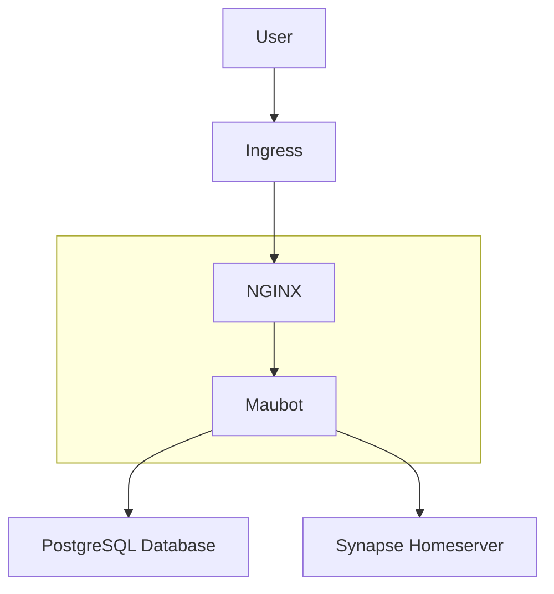

<!--
Avoid using this README file for information that is maintained or published elsewhere, e.g.:

* metadata.yaml > published on Charmhub
* documentation > published on (or linked to from) Charmhub
* detailed contribution guide > documentation or CONTRIBUTING.md

Use links instead.
-->

# Maubot operator

A Juju charm deploying and managing Maubot on Kubernetes.

Maubot is a plugin-based Matrix bot system written in Python.

## Architecture

## Project and community

The Maubot Operator is a member of the Ubuntu family. It's an open source
project that warmly welcomes community projects, contributions, suggestions,
fixes and constructive feedback.
* [Code of conduct](https://ubuntu.com/community/code-of-conduct)
* [Get support](https://discourse.charmhub.io/)
* [Join our online chat](https://matrix.to/#/#charmhub-charmdev:ubuntu.com)
* [Contribute](https://charmhub.io/maubot/docs/contributing)
* [Getting Started](https://charmhub.io/maubot/docs/getting-started)
Thinking about using the Maubot Operator for your next project? [Get in touch](https://matrix.to/#/#charmhub-charmdev:ubuntu.com)!
