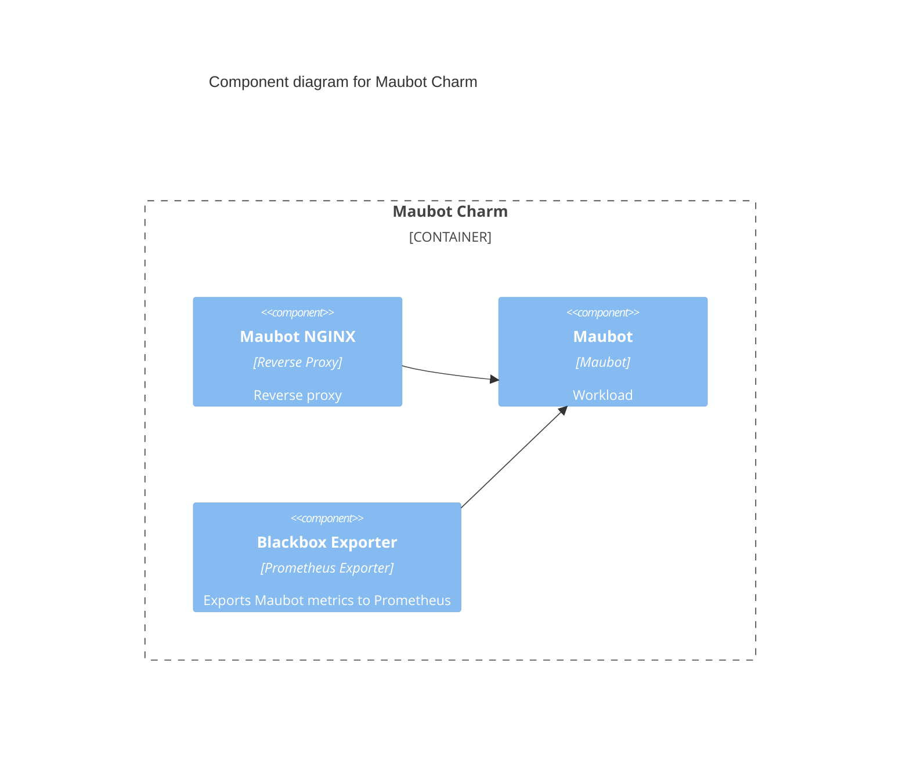

# Charm architecture

Maubot is a plugin-based [Matrix](https://matrix.org/) bot system written in Python.
It integrates with [PostgreSQL](https://www.postgresql.org/) as its database,
which is provided by the [PostgreSQL charm](https://charmhub.io/postgresql).

The Maubot charm can be integrated with the [Synapse charm](https://charmhub.io/synapse), enabling bot
installation and usage on the existing Matrix homeserver.

Pebble is a lightweight, API-driven process supervisor that is responsible for
configuring processes to run in a container and controlling those processes
throughout the workload lifecycle.



### Pebble layers

The Maubot charm deploys a container named `maubot` with the following Pebble layers configured:

1. maubot: This layer contains the Maubot application service.

2. nginx: Configures NGINX to efficiently serve static resources and acts as the entry point for all web traffic to the pod.

3. blackbox: A [Prometheus blackbox exporter](https://github.com/prometheus/blackbox_exporter) instance that collects metrics from the Maubot HTTP endpoint.


## OCI images

We use [Rockcraft](https://canonical-rockcraft.readthedocs-hosted.com/en/latest/)
to build OCI Image for Maubot.
The image is defined in [Maubot rock](https://github.com/canonical/maubot-operator/tree/main/maubot_rock) and is published to [Charmhub](https://charmhub.io/), the official repository
of charms.
This is done by publishing a resource to Charmhub as described in the
[Charmcraft How-to guides](https://canonical-charmcraft.readthedocs-hosted.com/en/stable/howto/manage-charms/#publish-a-charm-on-charmhub).

## Container

Configuration files for the container can be found in the respective
directory that define the rock, see the section above.

### NGINX

NGINX is configured as a Pebble Layer and is the entry point for all web traffic
to the pod (on port `8080`). Serves static files directly and forwards
non-static requests to the Maubot container (on port `29316`).

NGINX provides static content cache, reverse proxy, and load balancer among 
multiple application servers, as well as other features. It can be used in front of
Maubot server to significantly reduce server and network load.

### Maubot

Maubot is a Python application run by the `python3 -m maubot -c /data/config.yaml` command.
This command starts Maubot in the normal model, not in standalone mode. Read more
about the differences between them in the [Maubot documentation](https://docs.mau.fi/maubot/usage/standalone.html).

Maubot listens to non-TLS port `29316` serving by default. NGINX can then
forward non-static traffic to it.

The workload that this container is running is defined in the [Maubot rock](https://github.com/canonical/maubot-operator/tree/main/maubot_rock).

### Blackbox

Blackbox is a Prometheus exporter used to collect metrics from HTTP, HTTPS, DNS,
TCP, ICMP, and gRPC endpoints.

Using this exporter, it is possible to monitor Maubot's performance while
handling HTTP requests.


## Integrations

See [Integrations](https://charmhub.io/maubot/integrations).

## Charm code overview

The `src/charm.py` is the default entry point for a charm and has the
`MaubotCharm` Python class which inherits from the `CharmBase`.

CharmBase is the base class from which all Charms are formed, defined by [Ops](https://juju.is/docs/sdk/ops)
(Python framework for developing charms).

See more information in [Charm](https://documentation.ubuntu.com/juju/3.6/reference/charm/).

The `__init__` method guarantees that the charm observes all events relevant to
its operation and handles them.

Take, for example, when a configuration is changed by using the CLI.

1. User runs the command
```bash
juju config maubot public-url=myserver.myserver.com
```
2. A `config-changed` event is emitted.
3. Event handlers are defined in the charm's framework observers. An example looks like the following:
```python
self.framework.observe(self.on.config_changed, self._on_config_changed)
4. The method `_on_config_changed` will take the necessary actions. 
The actions include waiting for all the relations to be ready and then configuring
the containers.
